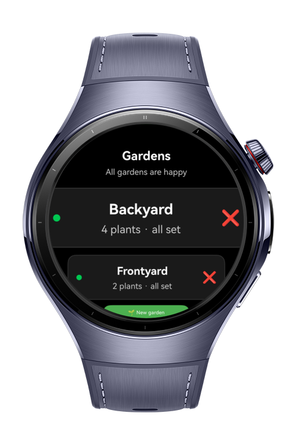
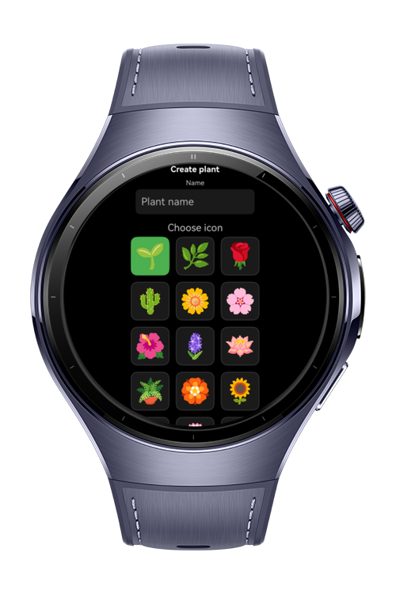
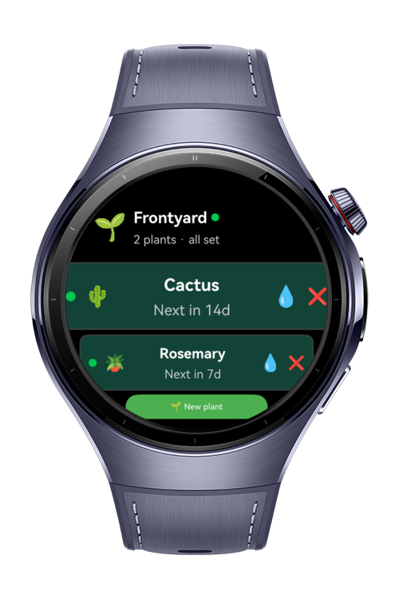
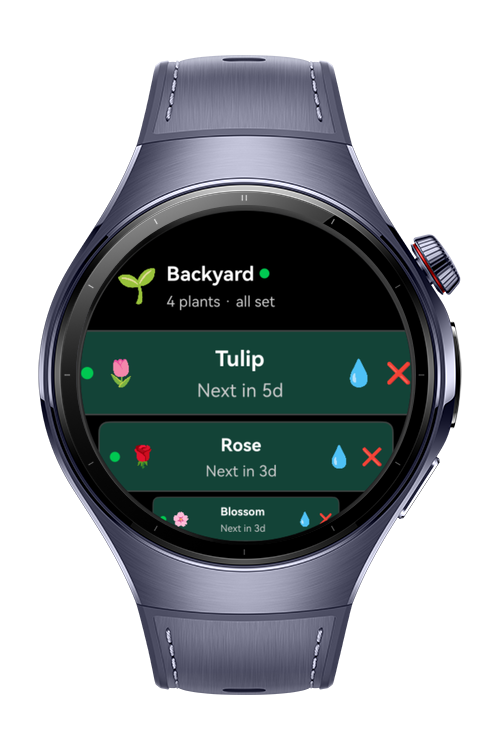

> **Note:** To access all shared projects, get information about environment setup, and view other guides, please visit [Explore-In-HMOS-Wearable Index](https://github.com/Explore-In-HMOS-Wearable/hmos-index).

# GardenHelper

An offline plant care and garden management application for HarmonyOS wearable devices.

# Preview

<div>
    
    
    
    
</div>

# Use Cases

- **Multi-Garden Management**: Organize plants by location
- **Outdoor Gardening**: Check plant status while working in the garden without pulling out your phone
- **Status Checks**: Look at your watch to see which plants need water today
- **Schedules**: Track watering schedules for plants across multiple gardens

# Tech Stack

- **Languages**: ArkTS, ArkUI
- **Frameworks**: HarmonyOS SDK 5.1.0(18)
- **Tools**: DevEco Studio Vers 5.1.0
- **Libraries**: @kit.ArkUI, @ohos/lottie, @kit.ArkData, @kit.BasicServicesKit
- **Architecture:** MVVM Pattern V2
- **Storage:** distributedKVStore (from @kit.ArkData)
  - Offline-first local data
  - Singleton service pattern

# Directory Structure

```
GardenHelper/
│
├── entry/                                          # Main application module
│   └── src/
│       └── main/
│           ├── ets/
│           │   ├── components/                     # Reusable UI components
│           │   │   ├── ThemedButton.ets
│           │   │   ├── ThemedText.ets
│           │   │   ├── ThemedStatusBadge.ets
│           │   │   ├── ThemedGardenRow.ets
│           │   │   ├── ThemedPlantRow.ets
│           │   │   ├── ThemedIcon.ets
│           │   │   ├── ThemedEmptyState.ets
│           │   │   ├── ThemedLoadingSpinner.ets
│           │   │   └── ThemedDivider.ets
│           │   ├── constants/                      # UI Theme constants                          
│           │   │   └── UIConstants.ets
│           │   ├── pages/                          # UI pages (screens)
│           │   │   ├── Index.ets               
│           │   │   ├── Gardens.ets
│           │   │   ├── GardenDetail.ets
│           │   │   ├── CreateGarden.ets
│           │   │   └── CreatePlant.ets
│           │   ├── services/
│           │   │   └── GardenStorageService.ets    # Data Persistence Service
│           │   ├── utils/
│           │   │   └── MediaUtils.ets              # Icon management
│           │   └── viewmodels/                     # MVVM ViewModels
│           │       ├── GardenBookViewModel.ets
│           │       ├── GardenViewModel.ets
│           │       └── PlantViewModel.ets
│           └── resources/                          # Assets and resources
│               ├── base/
│               │   ├── element/                    # Strings, colors, floats
│               │   └── media/                      # Icons
```

# Constraints and Restrictions

## Supported Devices
- Huawei Watch 5
- DevEco Studio Simulator

# LICENSE
**GardenHelper** is distributed under the terms of the MIT License.
See the [LICENSE](/LICENSE) for more information.
